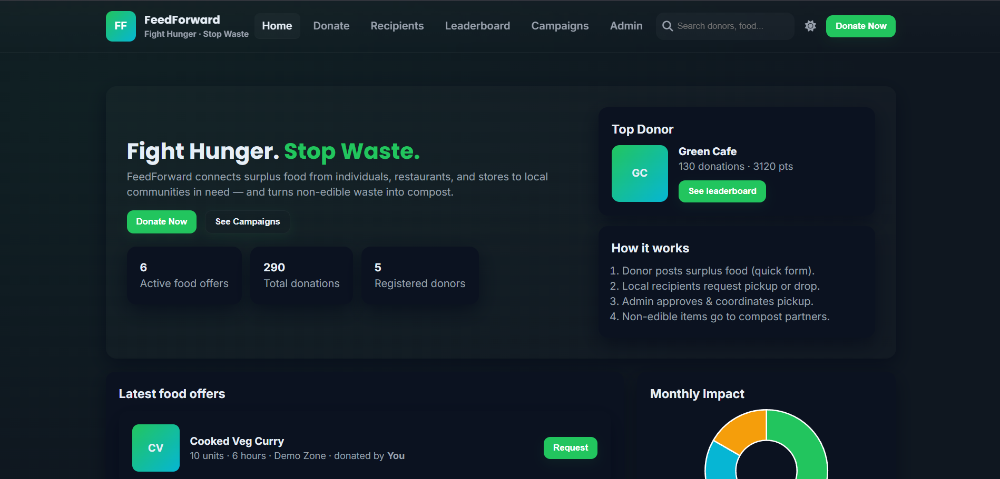

# FeedForward – Smart Food Donation & Sustainability Platform



FeedForward is a modern web prototype that connects individuals, restaurants, and stores with nearby communities to **donate surplus food**, reducing waste and increasing access to food.  
It also helps manage **non-edible waste** by converting it into compost and bone meal — fighting hunger while promoting sustainability. 🌱

---

## Features

- **Dynamic Single Page Experience** (HTML, CSS, JS)
- **Modern UI/UX** with minimalistic, consistent design
- **Theme System** using CSS variables (easy light/dark switch)
- **LocalStorage + JSON Data** for simulation of backend
- **Donation Dashboard**
  - Submit food donations
  - Track donation history
  - Auto leaderboard points
- **Recipient Dashboard**
  - Browse nearby food donations
  - Request pickup/delivery
  - Feedback mechanism
- **Leaderboard**
  - Highlights top food donors
  - Monthly champions and badges
- **Campaigns Section**
  - Awareness blogs, sustainability stories
  - Showcase real-world impact
- **Admin Panel**
  - Manage users and donations
  - Approve/reject requests
  - Visualize analytics with **Chart.js**
- **Responsive & Accessible** design (mobile-first)

---

## Project Structure

```
feedforward/
│── index.html # Main entry (with sections loaded dynamically)
│── style.css # Styling with CSS variables and responsive design
│── app.js # Application logic (routing, data, interactions)
│── assets/ # Images, icons, and static files
└── README.md # Documentation
```

## Tech Stack

Frontend: HTML5, CSS3 (variables, flex/grid), Vanilla JS

Data Handling: JSON objects + LocalStorage

Charts/Analytics: Chart.js

Design System: Minimalist, themeable, responsive

## Future Enhancements

Integration with Zomato & Swiggy APIs for scaling

Real backend using Node.js + Express + MongoDB

Native mobile app version

Donor reward system (vouchers, badges, recognition)

## Screens & Pages

Home Page – Mission + CTA

Donor Dashboard – Donation form + history

Recipient Dashboard – Browse food + request system

Leaderboard – Top donors & rewards

Campaigns – Awareness blogs

Admin Panel – Manage & visualize data

## Contact

Feel free to reach out if you have any questions or suggestions!

Website: adityadhiman.in

GitHub: github.com/adityadhiman-in

LinkedIn: linkedin.com/in/adityadhiman-in

Made with ❤️ by Aditya Dhiman
